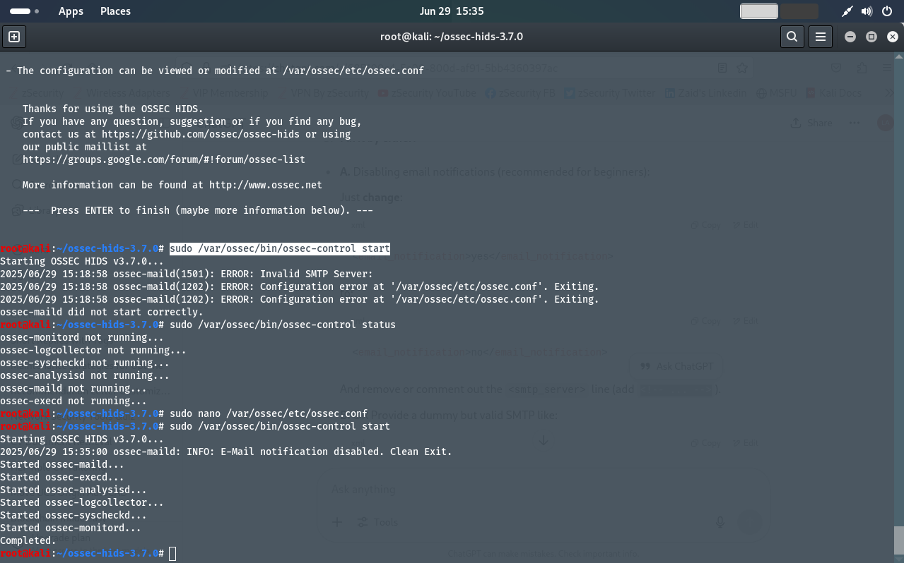

# ossec-hids-project

# Host-Based Intrusion Detection System (HIDS) using OSSEC

A beginner-level project to set up and configure OSSEC as a host-based intrusion detection system on Kali Linux.

---

## 📌 Why HIDS?

- Detect unauthorized access attempts
- Monitor system integrity
- Alert on suspicious activity
- Boost endpoint security

---

## ⚙️ Tools Used

- OSSEC (v3.7.0)
- Kali Linux
- Terminal / CLI

---

## 📷 Screenshots

> 

---

## 🛠️ Challenges Faced

- Repository update errors
- Missing dependencies like `libssl-dev`
- OSSEC compilation issues
- Mail configuration errors

✅ **Resolved** by:
- Updating Kali repository with correct components
- Installing dependencies manually
- Editing `ossec.conf` to fix SMTP errors

---

## ✅ Outcome

- Successfully installed and configured OSSEC
- Confirmed daemon running
- Sample alert logs generated

---

##  How to Run

```bash
cd ossec-hids-3.7.0
sudo ./install.sh
sudo /var/ossec/bin/ossec-control start
